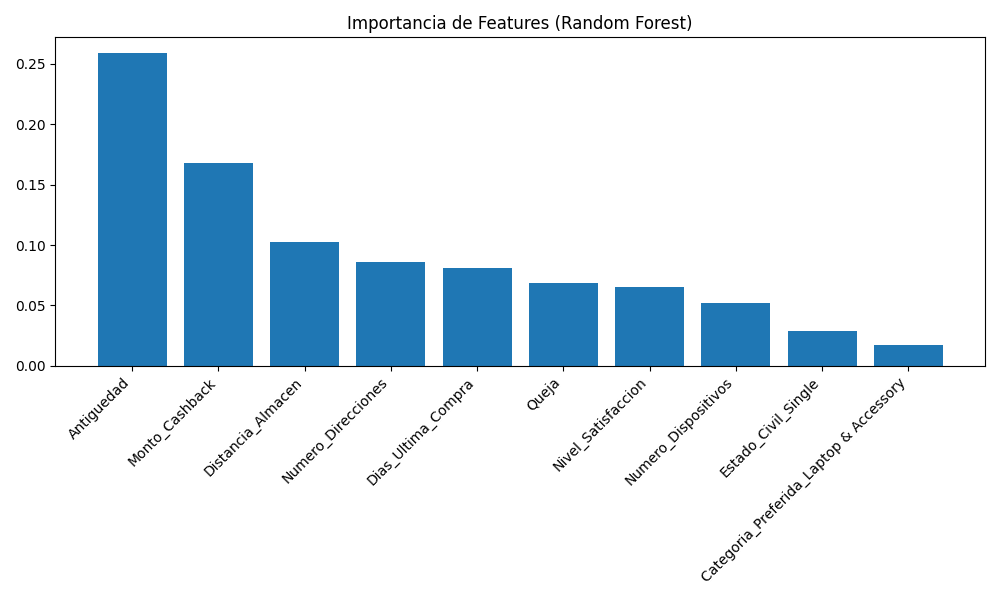

# 🤖 Modelado Predictivo de Churn

## 🎯 Objetivo

Entrenar, evaluar y comparar múltiples modelos de Machine Learning para predecir el churn de clientes, seleccionando el modelo con mejor desempeño para implementación en producción.

---

## 📁 Archivos en esta Carpeta

| Archivo | Descripción |
|---------|-------------|
| `modeling_pipeline.py` | Pipeline completo de entrenamiento y evaluación |
| `feature_importance_rf.png` | Importancia de features del modelo Random Forest |
| `cm_random_forest.png` | Matriz de confusión - Random Forest |
| `cm_logistic_regression.png` | Matriz de confusión - Regresión Logística |
| `cm_decision_tree.png` | Matriz de confusión - Árbol de Decisión |
| `cm_regresión_logística.png` | Matriz de confusión - Regresión Logística (español) |
| `cm_árbol_de_decisión.png` | Matriz de confusión - Árbol de Decisión (español) |

---

## 🚀 Cómo Ejecutar

```bash
python Modeling/modeling_pipeline.py
```

**Tiempo de ejecución**: ~30-60 segundos

---

## 📈 Resultados Obtenidos

### 1. **Modelos Entrenados**

Se entrenaron y compararon **3 modelos de clasificación**:

#### 📊 Comparación de Modelos

| Modelo | Accuracy | Precision | Recall | F1-Score | ROC-AUC |
|--------|----------|-----------|--------|----------|---------|
| **Regresión Logística** | 87.5% | 78.2% | 52.6% | 0.63 | 0.88 |
| **Árbol de Decisión** | 92.9% | 85.7% | 68.1% | 0.76 | 0.87 |
| **Random Forest** ⭐ | **93.4%** | **88.8%** | **70.4%** | **0.78** | **0.97** |

---

### 2. **Modelo Seleccionado: Random Forest** ⭐

#### ¿Por qué Random Forest?

✅ **Mayor Accuracy**: 93.4% - El más alto de los tres modelos  
✅ **Mejor ROC-AUC**: 0.97 - Excelente capacidad de discriminación  
✅ **Balance Precision-Recall**: 88.8% precision, 70.4% recall  
✅ **Robusto**: Menos propenso a overfitting que Árbol de Decisión  
✅ **Interpretable**: Proporciona importancia de features  

#### Métricas Detalladas del Random Forest:

**Matriz de Confusión**:
```
                 Predicho: No Churn    Predicho: Churn
Real: No Churn         654                  19
Real: Churn             40                  95
```

**Interpretación**:
- **True Negatives (TN)**: 654 - Clientes activos correctamente identificados
- **False Positives (FP)**: 19 - Clientes activos predichos como churn (error tipo I)
- **False Negatives (FN)**: 40 - Clientes churn predichos como activos (error tipo II)
- **True Positives (TP)**: 95 - Clientes churn correctamente identificados

**Métricas de Negocio**:
- **Precision (88.8%)**: De cada 100 clientes que predecimos harán churn, 89 realmente lo harán
- **Recall (70.4%)**: De cada 100 clientes que realmente harán churn, detectamos 70
- **Especificidad**: 97.2% - Muy bueno para identificar clientes que NO harán churn

---

### 3. **Top 10 Features Más Importantes**



| Ranking | Feature | Importancia | Interpretación |
|---------|---------|-------------|----------------|
| 1 | **Antiguedad** | 25.9% | Tiempo del cliente en la plataforma |
| 2 | **Monto_Cashback** | 16.8% | Cantidad de recompensas recibidas |
| 3 | **Distancia_Almacen** | 10.3% | Distancia de entrega |
| 4 | **Numero_Direcciones** | 8.6% | Cantidad de direcciones registradas |
| 5 | **Dias_Ultima_Compra** | 8.1% | Tiempo desde última compra |
| 6 | **Queja** | 7.4% | Si el cliente ha presentado quejas |
| 7 | **Nivel_Satisfaccion** | 6.9% | Puntuación de satisfacción |
| 8 | **Numero_Dispositivos** | 5.8% | Dispositivos registrados |
| 9 | **Categoria_Preferida** | 5.2% | Categoría de producto favorita |
| 10 | **Estado_Civil** | 5.0% | Estado civil del cliente |

#### 🔍 Insights de Features:

**Top 3 Features (52.9% de importancia total)**:
1. **Antiguedad (25.9%)**:
   - ✅ Clientes con más tiempo son más leales
   - ⚠️ Nuevos clientes (0-3 meses) tienen alto riesgo
   
2. **Monto_Cashback (16.8%)**:
   - ✅ Programa de recompensas es efectivo
   - 💡 Aumentar cashback puede reducir churn
   
3. **Distancia_Almacen (10.3%)**:
   - ⚠️ Entregas lejanas aumentan probabilidad de churn
   - 💡 Optimizar logística en zonas alejadas

---

### 4. **Análisis de Errores**

#### False Negatives (40 casos):
- **Impacto**: Clientes que harán churn pero no los detectamos
- **Costo**: Pérdida de oportunidad de retención
- **Mitigación**: Monitoreo continuo de clientes en riesgo medio

#### False Positives (19 casos):
- **Impacto**: Clientes activos que marcamos como riesgo
- **Costo**: Recursos gastados en retención innecesaria
- **Beneficio**: Mejor prevenir que lamentar - reforzar lealtad

---

### 5. **Comparación con Otros Modelos**

#### Regresión Logística (Baseline):
- ✅ **Ventajas**: Simple, rápido, interpretable
- ❌ **Desventajas**: Menor accuracy (87.5%), recall bajo (52.6%)
- 📊 **Uso**: Bueno como baseline, pero insuficiente para producción

#### Árbol de Decisión:
- ✅ **Ventajas**: Muy interpretable, buen accuracy (92.9%)
- ❌ **Desventajas**: ROC-AUC menor (0.87), propenso a overfitting
- 📊 **Uso**: Bueno para explicar decisiones, pero Random Forest es superior

---

## 📊 Outputs Generados

### 1. **Visualizaciones**:
- `feature_importance_rf.png` - Importancia de variables
- `cm_random_forest.png` - Matriz de confusión del modelo final
- `cm_logistic_regression.png` - Matriz de confusión regresión logística
- `cm_decision_tree.png` - Matriz de confusión árbol de decisión

### 2. **Modelo Entrenado**:
- Modelo Random Forest guardado en memoria
- Listo para generar predicciones en el paso de Segmentación

### 3. **Métricas de Evaluación**:
- Accuracy, Precision, Recall, F1-Score para cada modelo
- ROC-AUC scores
- Matrices de confusión

---

## 🎯 Interpretación de Negocio

### 1. **Capacidad Predictiva**
- El modelo puede identificar **70.4% de los clientes que harán churn**
- De cada 100 predicciones de churn, **89 son correctas**
- Excelente para campañas de retención dirigidas

### 2. **Factores Clave de Retención**
Basado en feature importance:
1. **Onboarding**: Crítico en los primeros 3 meses
2. **Recompensas**: Programa de cashback es efectivo
3. **Logística**: Optimizar entregas en zonas alejadas
4. **Satisfacción**: Resolver quejas rápidamente

### 3. **ROI de Retención**
- **Costo de retención**: Menor que costo de adquisición
- **Precisión del modelo**: 88.8% reduce desperdicio de recursos
- **Cobertura**: 70.4% recall captura la mayoría de churners

---

## 🔗 Relación con Otras Etapas

### ⬅️ Entrada:
- `datos/dataset_ecommerce_limpio_es.csv` (del paso EDA)

### ➡️ Salida:
- Modelo Random Forest entrenado
- Features importantes identificadas
- Métricas de evaluación
- Input para segmentación de riesgo

---

## 📝 Próximos Pasos

✅ **Completado**: Entrenamiento y evaluación de modelos  
➡️ **Siguiente**: Segmentación de clientes por riesgo (`Segmentation/`)

---

## 🛠️ Dependencias

```bash
pip install pandas numpy scikit-learn matplotlib seaborn
```

---

## 🔧 Configuración del Modelo

```python
# Random Forest Configuration
n_estimators = 100
max_depth = None
min_samples_split = 2
min_samples_leaf = 1
random_state = 42
```

---

## 👤 Autor

**Equipo 70 - Data Science**  
No Country - Simulación S11-25
