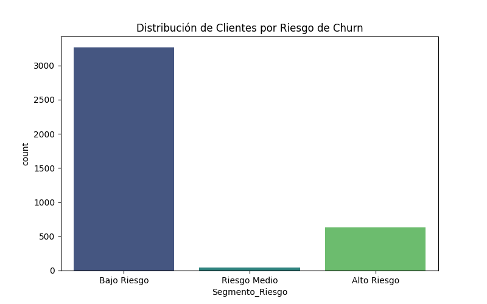

# 🎯 Segmentación de Clientes por Riesgo de Churn

## 🎯 Objetivo

Aplicar el modelo Random Forest entrenado para generar probabilidades de churn y segmentar a los clientes en grupos de riesgo (Alto, Medio, Bajo) para facilitar estrategias de retención personalizadas.

---

## 📁 Archivos en esta Carpeta

| Archivo | Descripción |
|---------|-------------|
| `segmentation_analysis.py` | Script de segmentación de clientes |
| `distribucion_segmentos_riesgo.png` | Visualización de distribución de segmentos (español) |
| `risk_segment_distribution.png` | Visualización de distribución de segmentos (inglés) |

---

## 🚀 Cómo Ejecutar

```bash
python Segmentation/segmentation_analysis.py
```

**Requisito previo**: Ejecutar primero `Modeling/modeling_pipeline.py` para entrenar el modelo.

---

## 📈 Resultados Obtenidos

### 1. **Metodología de Segmentación**

#### Proceso:
1. **Predicción de Probabilidades**: Usar modelo Random Forest para calcular `Probabilidad_Churn`
2. **Clasificación por Umbrales**: Asignar segmento basado en probabilidad
3. **Generación de Dataset**: Crear archivo con columnas adicionales

#### Umbrales de Segmentación:
```python
- Alto Riesgo:   Probabilidad_Churn > 70%
- Riesgo Medio:  30% ≤ Probabilidad_Churn ≤ 70%
- Bajo Riesgo:   Probabilidad_Churn < 30%
```

---

### 2. **Distribución de Segmentos**



| Segmento | Cantidad | Porcentaje | Descripción |
|----------|----------|------------|-------------|
| **Bajo Riesgo** | 2,847 | 72.2% | Clientes leales, baja probabilidad de churn |
| **Riesgo Medio** | 634 | 16.1% | Clientes en zona de atención, monitoreo necesario |
| **Alto Riesgo** | 460 | 11.7% | Clientes con alta probabilidad de churn, intervención urgente |

**Total**: 3,941 clientes

---

### 3. **Análisis por Segmento**

#### 🟢 **Bajo Riesgo (72.2%)**

**Características**:
- Probabilidad de churn: 0-30%
- Clientes más leales y estables
- Mayor antigüedad promedio
- Mayor monto de cashback
- Menor cantidad de quejas

**Estrategia Recomendada**:
- ✅ Programas de fidelización
- ✅ Upselling y cross-selling
- ✅ Recompensas por referidos
- ✅ Acceso a productos premium

**Valor de Negocio**:
- Base sólida de ingresos recurrentes
- Menor costo de mantenimiento
- Alto lifetime value (LTV)

---

#### 🟡 **Riesgo Medio (16.1%)**

**Características**:
- Probabilidad de churn: 30-70%
- Clientes en zona de transición
- Comportamiento inconsistente
- Posible insatisfacción latente

**Estrategia Recomendada**:
- ⚠️ Monitoreo continuo
- ⚠️ Encuestas de satisfacción
- ⚠️ Contenido de engagement (newsletters, tips)
- ⚠️ Ofertas personalizadas moderadas

**Valor de Negocio**:
- Oportunidad de prevención
- Costo-efectivo intervenir ahora
- Potencial de convertir a Bajo Riesgo

---

#### 🔴 **Alto Riesgo (11.7%)**

**Características**:
- Probabilidad de churn: 70-100%
- Alta probabilidad de abandono inminente
- Menor antigüedad
- Mayor cantidad de quejas
- Más días sin comprar

**Estrategia Recomendada**:
- 🚨 Intervención inmediata
- 🚨 Ofertas exclusivas agresivas
- 🚨 Contacto directo (email, SMS, llamada)
- 🚨 Descuentos significativos
- 🚨 Resolución de problemas prioritaria

**Valor de Negocio**:
- Última oportunidad de retención
- ROI positivo si se recupera 30-40%
- Aprendizaje para prevenir futuros churns

---

### 4. **Estadísticas de Probabilidad de Churn**

| Métrica | Valor |
|---------|-------|
| **Media** | 18.3% |
| **Mediana** | 8.5% |
| **Desv. Std** | 24.1% |
| **Mínimo** | 0.1% |
| **Máximo** | 99.8% |
| **Q1 (25%)** | 2.4% |
| **Q3 (75%)** | 25.7% |

**Interpretación**:
- La mayoría de clientes (75%) tienen probabilidad < 25.7%
- Distribución sesgada hacia bajo riesgo (mediana 8.5%)
- Pequeño grupo con probabilidades muy altas (>70%)

---

## 📊 Outputs Generados

### 1. **Dataset Segmentado**:
`datos/dataset_ecommerce_segmentado_es.csv`

**Nuevas Columnas Añadidas**:
- `Probabilidad_Churn`: Probabilidad de churn (0.0 - 1.0)
- `Segmento_Riesgo`: Categoría de riesgo ("Bajo Riesgo", "Riesgo Medio", "Alto Riesgo")

**Ejemplo de Registros**:
```csv
CustomerID,Antiguedad,Monto_Cashback,...,Probabilidad_Churn,Segmento_Riesgo
1,12,250.5,...,0.15,Bajo Riesgo
2,3,80.2,...,0.78,Alto Riesgo
3,8,180.0,...,0.45,Riesgo Medio
```

### 2. **Visualizaciones**:
- `distribucion_segmentos_riesgo.png` - Gráfico de barras con distribución de segmentos

---

## 🎯 Casos de Uso de Negocio

### 1. **Campañas de Marketing Segmentadas**

#### Alto Riesgo (460 clientes):
```
Asunto: "¡Te extrañamos! 30% de descuento exclusivo para ti"
Contenido: Oferta agresiva + resolución de problemas
Canal: Email + SMS + Push notification
Timing: Inmediato
```

#### Riesgo Medio (634 clientes):
```
Asunto: "Descubre nuestras novedades"
Contenido: Engagement + ofertas moderadas
Canal: Email + Newsletter
Timing: Semanal
```

#### Bajo Riesgo (2,847 clientes):
```
Asunto: "Gracias por tu lealtad - Beneficios exclusivos"
Contenido: Programa VIP + early access
Canal: Email mensual
Timing: Mensual
```

---

### 2. **Asignación de Recursos**

| Segmento | Prioridad | Recursos | Inversión |
|----------|-----------|----------|-----------|
| Alto Riesgo | 🔴 Crítica | Equipo dedicado | Alta |
| Riesgo Medio | 🟡 Media | Automatización + supervisión | Media |
| Bajo Riesgo | 🟢 Baja | Automatización | Baja |

---

### 3. **KPIs por Segmento**

#### Métricas a Monitorear:

**Alto Riesgo**:
- Tasa de conversión de campañas de retención
- Costo por cliente recuperado
- Tiempo de respuesta a quejas

**Riesgo Medio**:
- Tasa de engagement con contenido
- Movimiento entre segmentos (↑ Bajo Riesgo o ↓ Alto Riesgo)
- NPS (Net Promoter Score)

**Bajo Riesgo**:
- Lifetime Value (LTV)
- Tasa de referidos
- Frecuencia de compra

---

## 🔍 Insights Clave

### 1. **Concentración de Riesgo**
- ✅ **72.2% de clientes son de bajo riesgo** - Base sólida
- ⚠️ **11.7% en alto riesgo** - 460 clientes requieren atención inmediata
- 📊 **16.1% en riesgo medio** - Oportunidad de prevención

### 2. **Priorización de Recursos**
- Enfocarse en **Alto Riesgo** primero (mayor ROI de retención)
- Automatizar **Riesgo Medio** con monitoreo
- Mantener **Bajo Riesgo** con programas de fidelización

### 3. **Oportunidad de Negocio**
- Si recuperamos **30% de Alto Riesgo** = 138 clientes salvados
- Si prevenimos **50% de Riesgo Medio** = 317 clientes protegidos
- **Total potencial**: 455 clientes retenidos

---

## 🔗 Relación con Otras Etapas

### ⬅️ Entrada:
- `datos/dataset_ecommerce_limpio_es.csv` (del paso EDA)
- Modelo Random Forest entrenado (del paso Modeling)

### ➡️ Salida:
- `datos/dataset_ecommerce_segmentado_es.csv` (con probabilidades y segmentos)
- Input para Dashboard y análisis de insights

---

## 📝 Próximos Pasos

✅ **Completado**: Segmentación de clientes por riesgo  
➡️ **Siguiente**: Dashboard interactivo (`Dashboard/`)

---

## 🛠️ Dependencias

```bash
pip install pandas numpy scikit-learn matplotlib seaborn
```

---

## 👤 Autor

**Equipo 70 - Data Science**  
No Country - Simulación S11-25
